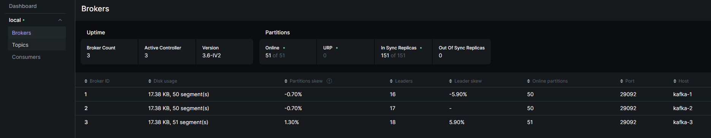
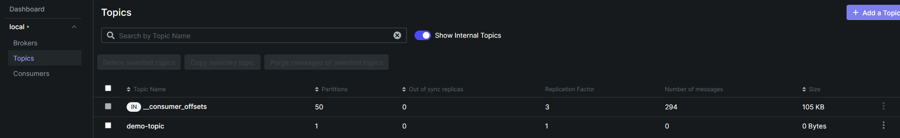
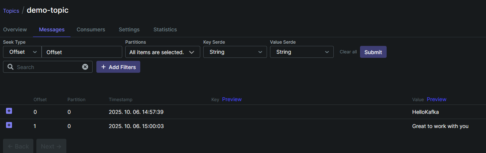

# concept-tester
A test project where future concepts can be tested.

## Kafka producer/consumer
The goal is to test Apache Kafka functionality on high level.
To use all the implemented methodologies, 
we need to set-up the project with the following commands:

1. To create the containers: **docker-compose up -d**
2. We might need to create the Kafka topic: **docker exec -it kafka-1 kafka-topics --create --topic demo-topic --bootstrap-server
      localhost:9092 --partitions 3 --replication-factor 3**
3. To start the application: **Run ConceptTesterApplication.main()**.

The **Kafka UI** is available under http://localhost:8081/.

After the successful start, the application should be green on the left,
while brokers should appear:

Under topics, demo-topic should appear:

Once all could stand-up properly, we can send
messages to the created demo-topic using **RequestParam named message**. 
- curl -X POST "http://localhost:8080/api/messages?message=HelloKafka"

After the request execution, some success logs should appear
in the application's messages, and the new message has to be 
listed on the topic's **Messages** tab as well:

Once the application was stopped, we can destroy the related containers as well:
- docker-compose down -v